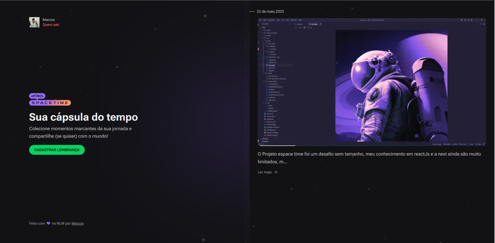

<h1 align="center">spacetime API</h1>

 Esse projeto foi feito em um evento gratuito, promovido pela Rocketseat

 

    

 

    

## Tecnologias

Foram utilizados neste projeto as seguintes tecnologias:

- ReactJS
- Typescript
- TSX
- Next
- Tailwind
- Jwt

 

## Projeto

O projeto consiste em uma página capas de guardar informações de imagem e texto, seu objetivo é ser uma página de recordações onde o usuário pode guardar suas lembranças de momentos especiais ou que achar importante

## :memo: Licença

Esse projeto está sob a licença MIT
